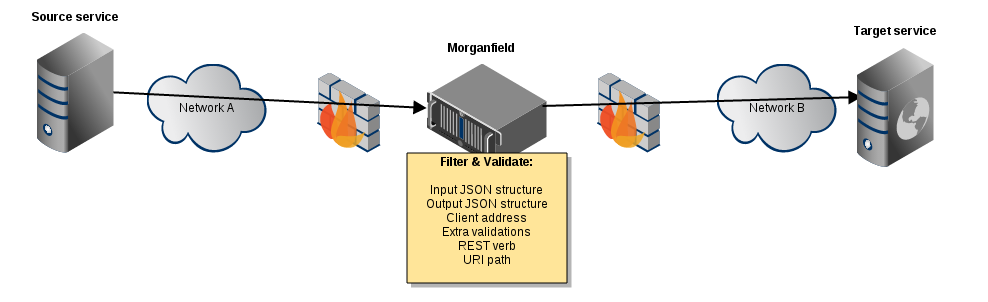

Morganfield
===========

Introduction
------------

Morganfield is a simple REST/JSON Information Exchange Gateway. It works by mimicking target services, proxying requests to them, and by forcing JSON message structure via means of marshaling & unmarshaling the messages against structure definitions. 



The application has minimal amount of moving parts, following the KISS principle. In ideal case the applications never notice that there is an extra component between them.

Installation
------------

```sh
go get github.com/mikkolehtisalo/morganfield
cd $GOPATH/src/github.com/mikkolehtisalo/morganfield
```

Define the allowed JSON messages in objects.go, for example:

```Go
type Auth_1_Session_Post_Request struct {
    Username string `json:"username"`
    Password string `json:"password"`
}
```

Define the allowed services in services.go, for example:

```Go
i, err := Create_Service_Definition(
    "GET",                          // Method
    "/rest/auth/1/session",         // Path (regexp string)
    "http",                         // Incoming service's protocol
    "localhost.localdomain",        // Incoming service's host
    "http",                         // Target service's protocol
    "dev.localdomain",              // Target service's host
    ".*",                           // Client limitation by address (most commonly fqdn)
    true,                           // Forwarding cookies?
    nil,                            // Input JSON
    Auth_1_Session_Get_Response{})  // Output JSON
if err != nil {
    syslog.Errf("%v", err)
    panic(err)
}
Services = append(Services, i)
```

Build morganfield, and install it:

```sh
make
sudo make install
```

Running as service
------------------

*make install* adds systemd service, so you can control the process by systemctl:

```sh
systemctl start morganfield
# Enable at system start
systemctl enable morganfield
```

The systemd service restarts automatically. You may want to edit */etc/systemd/system/morganfield.service* to include GOMAXPROCS environment value.

SELinux
-------

A simple SELinux policy is included. To install it, use make:

```sh
sudo make selinux
```

Enabling TLS
------------

Morganfield supports TLS for both in and outcoming connections. In order to enable TLS for incoming connections:

* Modify service definitions accordingly for *https* protocol
* Add server's certificate (*/opt/morganfield/etc/morganfield.crt*) and private key (*/opt/morganfield/etc/morganfield.key*)
* Edit morganfield.go. Change http.Server's Addr to *:443*, and switch the *server.ListenAndServe* to *server.ListenAndServeTLS*:

```Go
func main() {
    // ...
    server := &http.Server{
            Addr:           ":443", // <= Change the port
            // ...
        }
    //syslog.Errf("%v", server.ListenAndServe())
    syslog.Errf("%v", server.ListenAndServeTLS("/opt/morganfield/etc/morganfield.crt", "/opt/morganfield/etc/morganfield.key"))
}
```

To enable TLS for outgoing connections:

* Modify service definitions accordingly for *https* protocol
* Add CA certificate (required to check the identity of target services) */opt/morganfield/etc/extca.crt*
* Optionally to offer morganfield's identity, add certificate (*/opt/morganfield/etc/morganfield.crt*) and private key (*/opt/morganfield/etc/morganfield.key*)

Effects of filtering
--------------------

The JSON marshaling works only for well formed JSON. Any parsing failures stop handling requests further.

|Construct      |Description                |Handling               |
|---            |---                        |---                    |
|'...'          |Single quoted strings      |Parsing failure        |
|\xAB           |Hex integer literals       |Converted to unicode   |
|\012           |Octal integer literals     |Converted to unicode   |
|0xAB           |Hex integer literals       |Parsing failure        |
|012            |Octal integer literals     |Parsing failure        |
|[0,,2]         |Elisions                   |Parsing failure        |
|[1,2,3,]       |Trailing commas            |Parsing failure        |
|{foo:"bar"}    |Unquoted property names    |Parsing failure        |
|//comment      |Code comment               |Parsing failure        |
|(...)          |Grouping parentheses       |Parsing failure        |
|+.5            |Unstrict decimal formats   |Parsing failure        |
|{              |Missing brackets           |Parsing failure        |
|{  }}          |Mismatched brackets        |Parsing failure        |
|               |Only whitespace            |Parsing failure        |
|"foo":"baz"    |Unknown element            |Ignored & removed      |
|               |Missing elemement          |Default value used     |

Extra validation
----------------

Implementing the Validate() function for any object will allow extra validation step to be run between unmarshaling and marshaling object. For example:

```Go
func (a *Auth_1_Session_Post_Request) Validate() {
    // ... perform extra validation
    // ... change data
    // ... or perhaps panic
}
```

Logging
-------

Logging is done to syslog facility DAEMON. Request log messages are valid JSON.

Forwarding logs to something like [ELK](http://www.elasticsearch.org/overview/) is highly recommended. Please note that your syslog implementation has to support large (>1k) packets.

Performance
-----------

In short, morganfield can be easily scaled up to thousands of requests per second. Most usually the bottleneck will be the target services. 

In quick testing against simple GET service (Jira login information), and POST service (login to Jira) results looked like the following:

* Intel(R) Core(TM) i5-4570T CPU @ 2.90GHz 
* Fedora 20 (64-bit)
* Jira 6.3 (default settings, incl. HSQL database) in KVM virtual machine (1 vcpu)
* GOMAXPROCS=4 ./morganfield
* 20 concurrent users 
* GET => 250 req/s (avg 26ms)
* POST => 45 req/s (avg 476ms)
* Jira VM maxed out allotted CPU
* pprof on morganfield shows no locking issues, CPU usage is evenly distributed among network io, JSON marshaling / reflection, and memory allocations.

Credits
-------

Created by Mikko Lehtisalo <mikko.lehtisalo@gmail.com>.

Frequently Asked Questions
--------------------------

**Q**: Why REST/JSON? Why no *insert favorite technology here*?

**A**: Today approximately 2/3 of new applications implement REST/JSON API. Parsing JSON is technically must simpler and less error prone than, say, XML. That is not to say the alternatives do not have their uses.

**Q**: Why the settings are hard coded?

**A**: Simplicity. Bolting down the configuration in order to protect them against changes.
